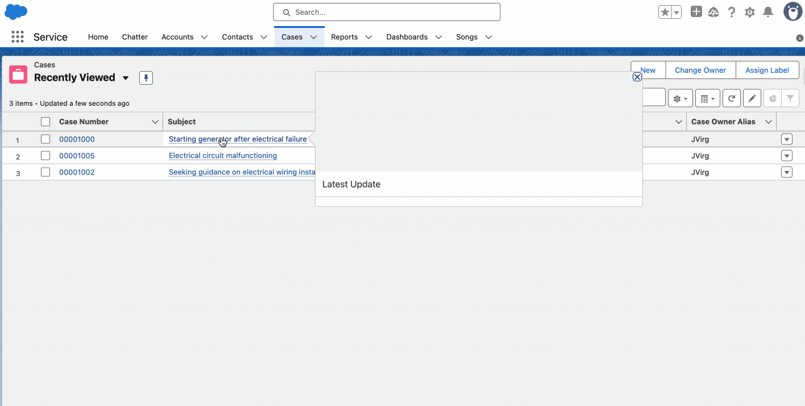

# SF-LWC-PdfJs
A SF Lightning Web Component for rendering & viewing PDF files in Salesforce.
It uses Pdf.js library  Salesforce Lightning Web Component LWC.

## Demo

## Features

- PDF rendering with Mozilla's PDF.js library
- Works with files attached to Salesforce records
- Responsive design for different screen sizes

## Components

- `pdfjsviewer` - Main component for viewing PDFs
- `PdfViewerController` - Apex controller for retrieving PDF content

## Setup

1. Deploy the components to your Salesforce org
2. Upload the PDF.js library as a static resource named "pdfjs"
3. Add the component to record pages that have PDF attachments

## Technical Details

- Uses PDF.js v3.11.174.  This is the last version of PDF.js that was built using the UMC javascript standard.  Subsequent versions of PDF.js have been built using the ES6 standard.
- Handles base64 encoding/decoding for PDF content